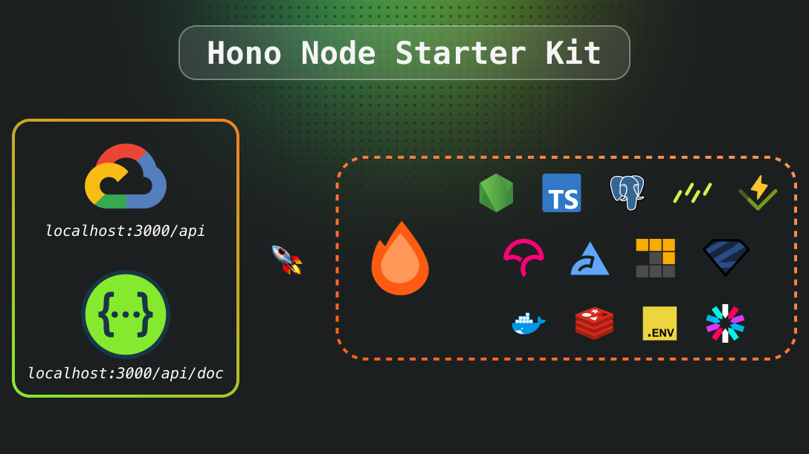

# Hono Rest API Starter Kit
[](https://codecov.io/github/risqiromadhoni/hono-node-starter)

Welcome to the **Hono Node Starter Kit**, a robust and scalable Node.js starter template built with modern technologies to streamline the development of APIs and web applications. This kit is designed to accelerate your project setup with essential integrations and best practices, helping you focus on building your core application.

## Features

- **Hono**: Lightweight and fast framework for building APIs.
- **Node.js & TypeScript**: Write reliable, maintainable, and scalable code.
- **PostgreSQL**: A powerful, open-source object-relational database.
- **Biome**: Ensure code quality with linting.
- **Vitest & V8**: A complete and easy-to-set-up testing framework.
- **Swagger UI**: Auto-generated API documentation (`localhost:3000/api/doc`).
- **Redis**: Fast in-memory data store.
- **Docker**: Containerized environment for development and production.
- **Environment Configuration**: Manage environment variables with `.env`.
- **Logging**: Centralized logging for better debugging.

## Requirements

- Node.js >=v18+
- Pnpm
- Docker (for containerized setup)
- PostgreSQL
- Redis

## Getting Started

### 1. Clone the repository

```bash
git clone https://github.com/risqiromadhoni/hono-node-starter.git
cd hono-node-starter
```

### 2. Install dependencies

```bash
pnpm install
```

### 3. Configure Environment Variables

Copy the `.env.example` to `.env` and update the values as needed.

```bash
cp .env.example .env
```

### 4. Start the Development Server

Run the server locally:

```bash
pnpm run dev
```

The API will be available at `http://localhost:3000/api` and the Swagger documentation at `http://localhost:3000/api/doc`.

### 5. Docker Setup

To run the project in Docker:

```bash
docker-compose up --build
```

This will start all the required services, including PostgreSQL and Redis, in a containerized environment.

## Deployment

The kit is configured for easy deployment on Google Cloud. Make sure to update the cloud configuration files before deploying.

```bash
gcloud app deploy
```

## Contributing

We welcome contributions! Feel free to submit a pull request or open an issue to report bugs or request new features.

## License

This project is licensed under the MIT License - see the [LICENSE](LICENSE) file for details.
